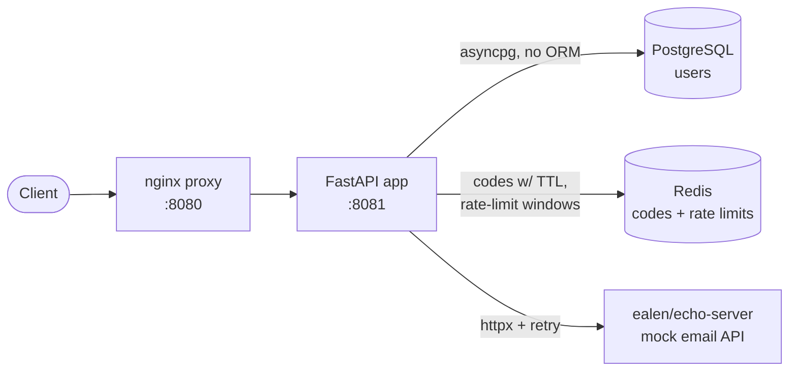

# User Registration API

A service that registers users and activates their
accounts with a time-limited 4-digit code emailed through a third-party provider.

Built with **FastAPI** (async, dependency injection, Pydantic validation,
lifespan events, exception handlers), **PostgreSQL** (raw SQL via `asyncpg` - **no ORM**),
**Redis** for everything that expires, and **ealen/echo-server** as a stand-in for the third-party email API.

---

## Use cases

1. **Register** — `POST /users` with an email + password. Creates the account and emails a 4-digit code.
2. **Activate** — `POST /users/activate` with HTTP **Basic auth** (email + password) and the code. Valid for **60 seconds**.

---

## Architecture


---

## Running it

Only Docker + Docker Compose are required.

```bash
docker compose up --build
```

The API is served through the nginx proxy at **http://localhost:8080**.
Interactive docs: **http://localhost:8080/docs**.
And documentation: **http://localhost:8080/redoc**.

### Try it end-to-end

```bash
# 1) Register — always returns a generic 202 (no account enumeration)
curl -i -X POST http://localhost:8080/users \
  -H 'Content-Type: application/json' \
  -d '{"email":"user@example.com","password":"secretpw!"}'
```


---

## Observability

### Structured JSON logs

The app logs to **stdout** as one JSON object per line, so the output can be
ingested as-is by a log collector. Each record carries `timestamp`, `level`,
`logger`, `message`, the `request_id` (see below) when emitted inside a request,
an `exception` traceback on errors, and any structured `extra` fields:

```json
{"timestamp":"2026-06-14T19:41:43.973+00:00","level":"INFO","logger":"app.services.user_service","message":"register: start email=jerome@botineau.com","request_id":"9f1c…","email":"jerome@botineau.com"}
```

The verbosity is controlled by the **`LOG_LEVEL`** environment variable
(`DEBUG`, `INFO`, `WARNING`, `ERROR`; default **`INFO`**).

### Correlation IDs (`X-Request-ID`)

Every request is tagged with a correlation ID so its logs can be traced
end-to-end:

- if the request comes in with an **`X-Request-ID`** header it is reused,
  otherwise a fresh one is generated;
- the ID is **echoed back** in the response `X-Request-ID` header;
- it appears as `request_id` on every log line produced while handling the
  request (routes, services and repositories alike).

```bash
curl -i -X POST http://localhost:8080/users \
  -H 'Content-Type: application/json' \
  -H 'X-Request-ID: trace-42' \
  -d '{"email":"jerome@botineau.com","password":"secretpw!"}'
# -> response includes:  X-Request-ID: trace-42
```

---

## Testing

Run the full suite in a container (no local Python needed):

First choose a db password and store it :
```
echo <your-password> > db/password.txt
```

```bash
docker compose run --rm tests
```