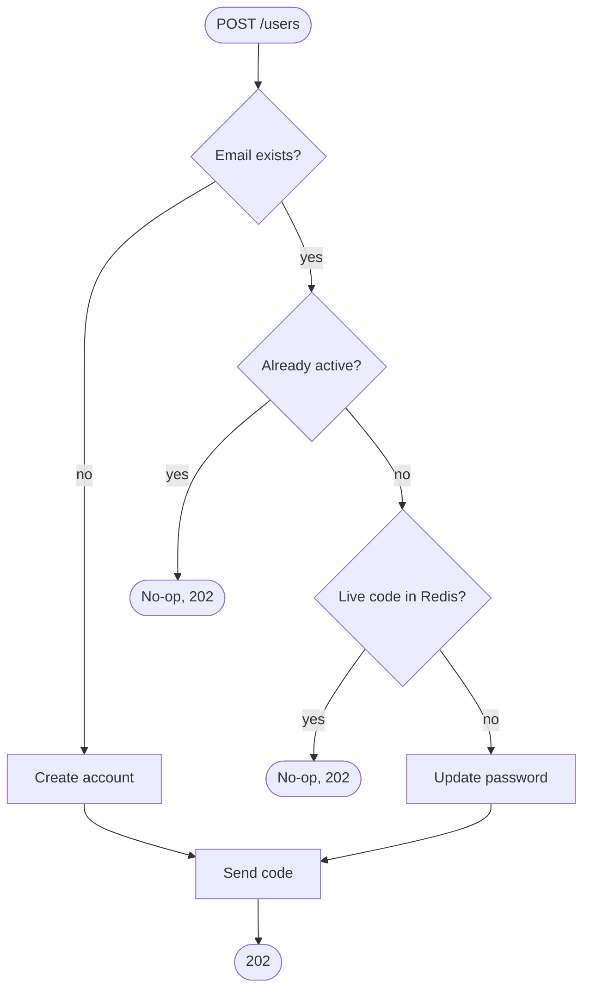

# User Registration API

A service that registers users and activates their
accounts with a time-limited 4-digit code emailed through a third-party provider.

Built with **FastAPI** (async, dependency injection, Pydantic validation,
lifespan events, exception handlers), **PostgreSQL** (raw SQL via `asyncpg` - **no ORM**),
**Redis** for everything that expires, and **ealen/echo-server** as a stand-in for the third-party email API.

---

## Use cases

1. **Register** — `POST /users` with an email + password. Creates the account and emails a 4-digit code.
2. **Activate** — `POST /users/activate` with HTTP **Basic auth** (email + password) and the code. Valid for **60 seconds**.

---

## Registration & activation logic

### Registration decision (`POST /users`)

The endpoint is **enumeration-safe**: every caller gets the same generic `202`,
and the bcrypt hash is computed on every branch so the response timing never
reveals whether the email already exists. Internally, `register()` picks one of
four branches, **in order**:

| # | Account state | Action |
|---|---|---|
| 1 | **Unknown email** | Create the account and send a fresh code. |
| 2 | **Already active** | Do nothing — the account is registered. |
| 3 | **Pending, code still live** | Do nothing — a valid code is already in flight (no resend while one is usable). |
| 4 | **Pending, no live code** | Update the password and send a fresh code, so the user can pick up where an expired code left off. |



Branches 1 and 4 then go through `_issue_code`, which is subject to the
[per-address email rate limit](#activation-emails-per-address) before a code is
generated, stored in Redis under its TTL, and emailed.

### Activation (`POST /users/activate`)

Credentials are verified **first** (a dummy-hash verify runs for unknown emails
so "no such user" and "wrong password" are indistinguishable — same `401`, same
latency). Activation is **idempotent**: an already-active account returns success
without re-checking the code. Otherwise the 4-digit code is checked against the
Redis copy within its TTL, with at most `ACTIVATION_MAX_ATTEMPTS` (3) guesses;
requesting a new code resets the budget.

---

## Architecture


**Layered, framework-light design** — each layer depends only on the one below
it, and the service/domain layers know nothing about FastAPI, which keeps them
unit-testable:

```
backend/app
├── main.py                  # app factory + lifespan (open/close db pool, redis, email client)
├── api
│   ├── deps.py              # DI providers (settings, db, redis, repos, services)
│   ├── errors.py            # domain-error -> JSON exception handlers
│   ├── middleware.py        # pure-ASGI correlation-ID middleware (X-Request-ID)
│   └── v1
│       ├── router.py        # aggregates the v1 routers
│       └── routes/users.py  # HTTP endpoints (thin)
├── core
│   ├── config.py            # pydantic-settings (env-driven)
│   ├── exceptions.py        # framework-agnostic domain errors
│   ├── logging.py           # JSON log formatter + request_id ContextVar
│   └── security.py          # bcrypt hashing, dummy-hash, code generation
├── db
│   ├── postgres.py          # asyncpg pool + .sql migrations on startup
│   ├── redis.py             # redis.asyncio client factory
│   └── migrations/001_init.sql
├── repositories
│   └── user_repository.py   # raw parameterised SQL -> UserRecord
├── schemas/user.py          # Pydantic request/response models
└── services
    ├── user_service.py      # registration/activation business logic
    ├── codes.py             # activation codes in Redis (TTL = expiry)
    ├── email.py             # EmailSender Protocol + HttpEmailSender (retry)
    └── rate_limit.py        # sliding-window limiter + signup/email policies
```

Infrastructure handles (settings, DB pool, Redis client, email sender) are
opened once in the **lifespan** and stashed on `app.state`; repositories and
services are assembled from them through `Depends`, so tests can swap any
collaborator via `app.dependency_overrides`.

---

## Running it

Only Docker + Docker Compose are required.

```bash
# First choose a db password and store it :
echo <your-password> > db/password.txt
docker compose up --build
```

The API is served through the nginx proxy at **http://localhost:8080**.
Interactive API docs are available at **`/docs`** and **`/redoc`**
(see [API documentation](#api-documentation) below).

### Try it end-to-end

```bash
# 1) Register — always returns a generic 202 (no account enumeration)
curl -i -X POST http://localhost:8080/users \
  -H 'Content-Type: application/json' \
  -d '{"email":"user@example.com","password":"secretpw!"}'

# 2) Read the 4-digit code. The email provider is mocked by echo-server, which
#    logs the full request body (where the code lives):
docker compose logs email | grep -oE 'activation code is [0-9]{4}'

# 3) Activate with Basic auth (email:password) + the code (within 60s)
curl -i -X POST http://localhost:8080/users/activate \
  -u 'user@example.com:secretpw!' \
  -H 'Content-Type: application/json' \
  -d '{"code":"1234"}'
```

---

## API documentation

The API is **self-documenting**: FastAPI generates an OpenAPI schema from the
route definitions and Pydantic models, so the docs are *living documentation*
that always matches the running code — there is nothing to keep in sync by hand.

| What | URL | Notes |
|---|---|---|
| **Swagger UI** | http://localhost:8080/docs | Interactive — try requests straight from the browser. |
| **ReDoc** | http://localhost:8080/redoc | Read-oriented, single-page reference. |
| **OpenAPI schema** | http://localhost:8080/openapi.json | Raw spec, for client/SDK generation or import into Postman/Insomnia. |

Both pages expose, per endpoint, the request/response models with **examples**,
every documented status code (`202`, `400`, `401`, `422`, `429`, …) with its
error body, and the HTTP Basic security scheme used by activation. The app
title, version and endpoint descriptions come from
[`backend/app/main.py`](backend/app/main.py); the per-route responses and
examples live in [`backend/app/api/v1/routes/users.py`](backend/app/api/v1/routes/users.py)
and [`backend/app/schemas/user.py`](backend/app/schemas/user.py).

### Error responses

Every error shares the same body shape — `{"detail": "<human-readable reason>"}`
— produced by the domain-exception handler in
[`backend/app/api/errors.py`](backend/app/api/errors.py).

| Endpoint | Status | When it happens | `Retry-After` |
|---|---|---|---|
| both | `422 Unprocessable Entity` | Payload fails validation: bad email, password not 8–72 chars, or code not exactly 4 digits. | — |
| `POST /users` | `202 Accepted` | Always on success — generic, enumeration-safe (new / pending / already active are indistinguishable). | — |
| `POST /users` | `429 Too Many Requests` | Per-IP signup cap (`SIGNUP_RATE_LIMIT`, 50/h) **or** per-address email cap (`EMAIL_SEND_*`, 3/h & 10/day) reached. | yes — `3600` or `86400` |
| `POST /users` | `502 Bad Gateway` | The email provider is unreachable after `EMAIL_API_RETRY_ATTEMPTS` retries. The code is already stored in Redis, so the user can retry registration. | — |
| `POST /users/activate` | `200 OK` | Code valid → account activated. Idempotent: returns `200` too if the account was already active. | — |
| `POST /users/activate` | `400 Bad Request` | Code is wrong, already used, or past its TTL. Each wrong guess counts toward the attempt cap. | — |
| `POST /users/activate` | `401 Unauthorized` | Wrong Basic-auth credentials — identical whether the account exists or not. | — |
| `POST /users/activate` | `429 Too Many Requests` | The `ACTIVATION_MAX_ATTEMPTS` (3) guess cap on the current code is exhausted; request a fresh code to reset it. | no |

> Note the two distinct `429`s: rate-limit rejections (signup IP, email-per-address)
> carry a `Retry-After`, while the activation **attempt cap** does not — it clears
> only when a new code is issued.

---

## Observability

### Structured JSON logs

The app logs to **stdout** as one JSON object per line, so the output can be
ingested as-is by a log collector. Each record carries `timestamp`, `level`,
`logger`, `message`, the `request_id` (see below) when emitted inside a request,
an `exception` traceback on errors, and any structured `extra` fields:

```json
{"timestamp":"2026-06-14T19:41:43.973+00:00","level":"INFO","logger":"app.services.user_service","message":"register: start email=jerome@botineau.com","request_id":"9f1c…","email":"jerome@botineau.com"}
```

The verbosity is controlled by the **`LOG_LEVEL`** environment variable
(`DEBUG`, `INFO`, `WARNING`, `ERROR`; default **`INFO`**).

### Correlation IDs (`X-Request-ID`)

Every request is tagged with a correlation ID so its logs can be traced
end-to-end:

- if the request comes in with an **`X-Request-ID`** header it is reused,
  otherwise a fresh one is generated;
- the ID is **echoed back** in the response `X-Request-ID` header;
- it appears as `request_id` on every log line produced while handling the
  request (routes, services and repositories alike).

```bash
curl -i -X POST http://localhost:8080/users \
  -H 'Content-Type: application/json' \
  -H 'X-Request-ID: trace-42' \
  -d '{"email":"jerome@botineau.com","password":"secretpw!"}'
# -> response includes:  X-Request-ID: trace-42
```

---

## Configuration

All settings are read from **environment variables**, validated by Pydantic in
[`app/core/config.py`](backend/app/core/config.py). The defaults below match the
Docker Compose setup, so nothing has to be set to run locally.

| Variable | Default | Description |
|---|---|---|
| `LOG_LEVEL` | `INFO` | Log verbosity (`DEBUG`/`INFO`/`WARNING`/`ERROR`). |
| `DATABASE_URL` | *(unset)* | Full asyncpg DSN. Wins over the `DB_*` parts when set. |
| `DB_HOST` / `DB_PORT` | `db` / `5432` | PostgreSQL host and port. |
| `DB_USER` / `DB_NAME` | `postgres` / `users` | PostgreSQL user and database. |
| `DB_PASSWORD` | `postgres` | PostgreSQL password (ignored if `DB_PASSWORD_FILE` is set). |
| `DB_PASSWORD_FILE` | *(unset)* | Path to a Docker secret file holding the password. |
| `DB_POOL_MIN_SIZE` / `DB_POOL_MAX_SIZE` | `1` / `10` | asyncpg connection pool bounds. |
| `REDIS_URL` | `redis://redis:6379/0` | Redis connection URL. |
| `CODE_TTL_SECONDS` | `60` | Activation-code validity window (Redis TTL). |
| `ACTIVATION_MAX_ATTEMPTS` | `3` | Max code guesses per issued code before lockout. |
| `SIGNUP_RATE_LIMIT` | `50` | Max registrations per IP within the window (see below). |
| `SIGNUP_RATE_LIMIT_WINDOW_SECONDS` | `3600` | Rolling window for the per-IP signup limit. |
| `EMAIL_SEND_HOURLY_LIMIT` | `3` | Max activation emails per address per hour. |
| `EMAIL_SEND_DAILY_LIMIT` | `10` | Max activation emails per address per day. |
| `EMAIL_API_URL` | `http://email/` | Third-party email API endpoint. |
| `EMAIL_API_TIMEOUT_SECONDS` | `5.0` | Per-request timeout for the email API. |
| `EMAIL_API_RETRY_ATTEMPTS` | `3` | Retry attempts when sending the activation email. |

---

## Rate limiting

`POST /users` is capped at **50 registrations per IP per hour** — a sliding
window stored in Redis. Once the budget is spent the endpoint returns **`429 Too
Many Requests`** with a **`Retry-After`** header, before any account work is
done. Tune it with `SIGNUP_RATE_LIMIT` / `SIGNUP_RATE_LIMIT_WINDOW_SECONDS`.

The client IP comes from `X-Forwarded-For` (uvicorn runs with `--proxy-headers`
behind the nginx proxy). Activation is separately protected by a per-code guess
cap (`ACTIVATION_MAX_ATTEMPTS`, default 3).

### Activation emails per address

Each address is also capped on **how many activation codes it can be emailed** —
**3 per hour** and **10 per day** (`EMAIL_SEND_HOURLY_LIMIT` /
`EMAIL_SEND_DAILY_LIMIT`), enforced over two Redis sliding windows at once. Both
the initial send and every resend count; exceeding either window returns
**`429`** with a `Retry-After` (3600 or 86400). This blunts email-bombing via the
resend path without locking the address out for long.

---

## Testing

Run the full suite in a container (no local Python needed):

```bash
docker compose run --rm tests
```