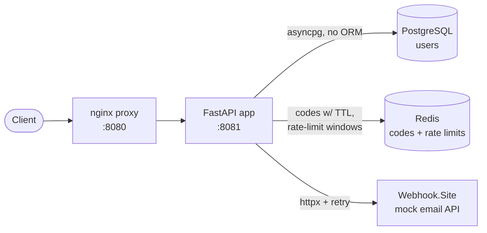

# User Registration API

A service that registers users and activates their
accounts with a time-limited 4-digit code emailed through a third-party provider.

Built with **FastAPI** (async, dependency injection, Pydantic validation,
lifespan events, exception handlers), **PostgreSQL** (raw SQL via `asyncpg` - **no ORM**),
**Redis** for everything that expires, and **Webhook.site** as a stand-in for the third-party email API.

---

## Use cases

1. **Register** — `POST /users` with an email + password. Creates the account and emails a 4-digit code.
2. **Activate** — `POST /users/activate` with HTTP **Basic auth** (email + password) and the code. Valid for **60 seconds**.

---

## Architecture

